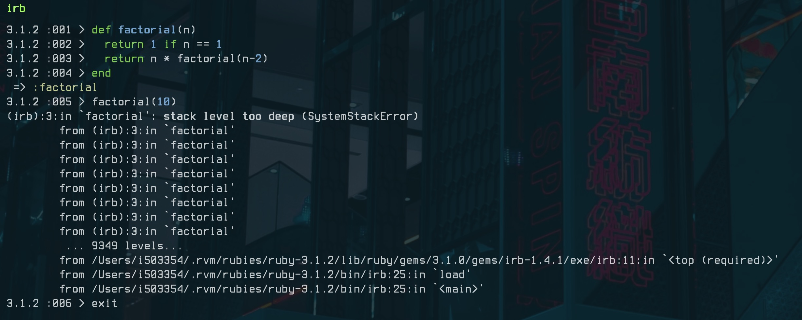

1. The following function prints every other number from a low number to a high number. For example, if low is 0 and
   high is 10, it would print:
   0 2 4 6 8 10
   Identify the base case in the function:

```ruby

def print_every_other(low, high)
  return if low > high # this is a base case.
  puts low
  print_every_other(low + 2, high)
end

print_every_other(0, 11)
```

2. My kid was playing with my computer and changed my factorial function so that it computes factorial based on (n - 2)
   instead of (n - 1). Predict what will happen when we run factorial(10) using this function:
   SystemStackError when n == 0 and become negative
   

```ruby

def factorial(n)
  return 1 if n == 1
  return n * factorial(n - 2)
end
```

3. Following is a function in which we pass in two numbers called low and high. The function returns the sum of all the
   numbers from low to high. For example, if low is 1, and high is 10, the function will return the sum of all numbers
   from 1 to 10, which is 55. However, our code is missing the base case, and will run indefinitely! Fix the code by
   adding the correct base case:

```ruby

def sum(low, high)
  return low if low == high # add base case
  return high + sum(low, high - 1)
end
```

4. Here is an array containing both numbers as well as other arrays, which in turn contain numbers and arrays:
   array=[ 1,
   2,
   3,
   [4, 5, 6],
   7,
   [8,
   [9, 10, 11,
   [12, 13, 14]
   ]
   ],
   [15, 16, 17, 18, 19,
   [20, 21, 22,
   [23, 24, 25,
   [26, 27, 29]
   ], 30, 31 ], 32
   ], 33 ]
   Write a recursive function that prints all the numbers (and just numbers).
